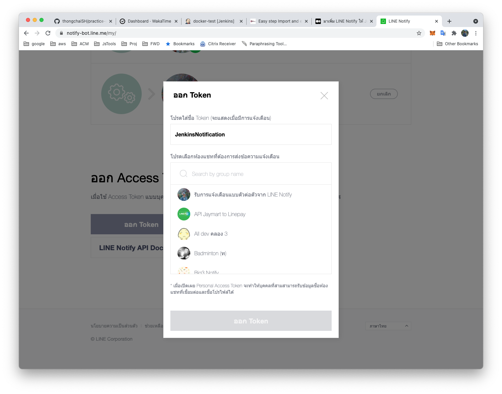
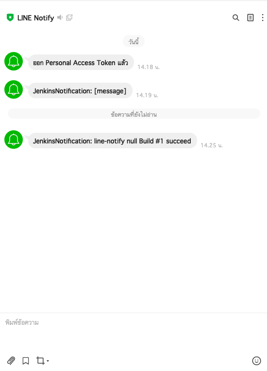
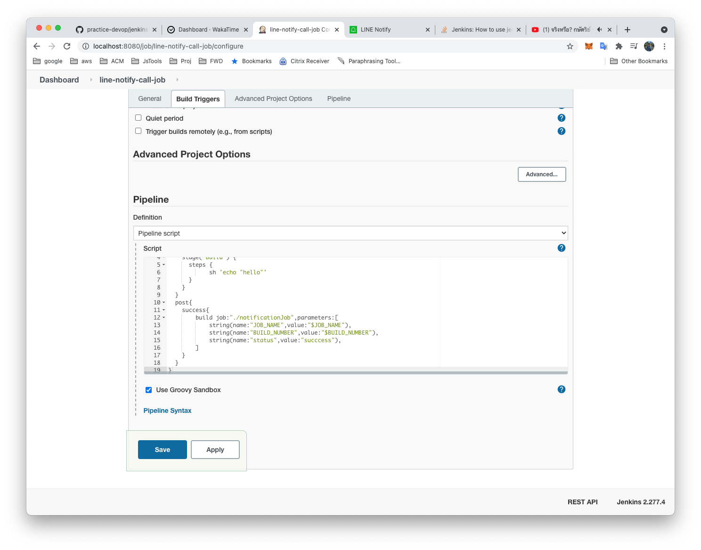
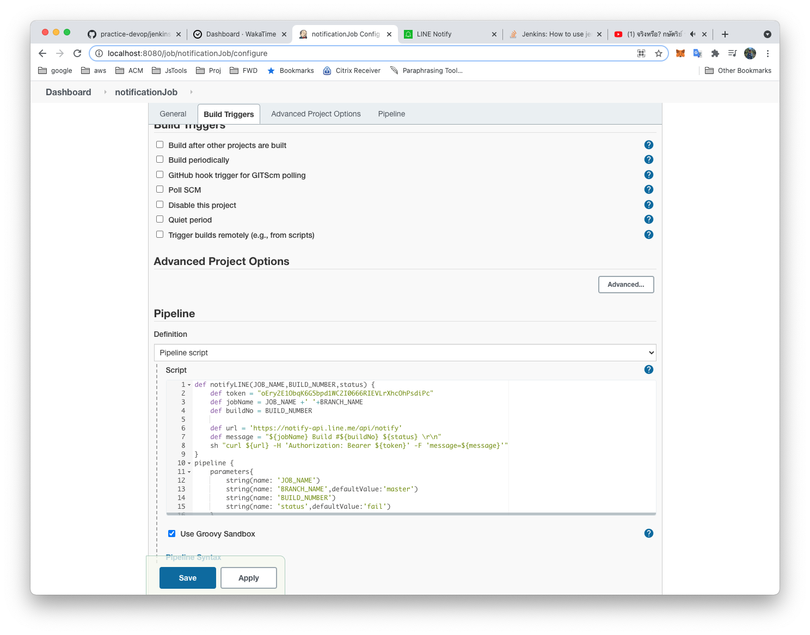

# Jenkins notification with line

## Register Line Notify
- https://notify-bot.line.me/my/
## Generate token


**Test call api**
```
curl https://notify-api.line.me/api/notify -H "Authorization: Bearer [LINE Access Token]" -F "message=[message]"
```

## Pipeline script
```
def notifyLINE(status) {
    def token = "[LINE Access Token]"
    def jobName = env.JOB_NAME +' '+env.BRANCH_NAME
    def buildNo = env.BUILD_NUMBER
      
    def url = 'https://notify-api.line.me/api/notify'
    def message = "${jobName} Build #${buildNo} ${status} \r\n"
    sh "curl ${url} -H 'Authorization: Bearer ${token}' -F 'message=${message}'"
}

pipeline {
  agent any
  stages {
    stage('Build') {
      steps {
            sh 'dotnet ef database update -p "Mockup.DAL/Mockup.DAL.csproj" -s "Mockup/Mockup.csproj"'
            sh 'dotnet test "Mockup.Test/Mockup.Test.csproj"'        		
      }
    }
  }
  post{
    success{
        notifyLINE("succeed")
    }
    failure{
        notifyLINE("failed")
    }
  }
}
```

## Complete


## Call build job
**MainJob**
```
build job:"./notificationJob",parameters:[
            string(name:"JOB_NAME",value:"$JOB_NAME"),
            string(name:"BUILD_NUMBER",value:"$BUILD_NUMBER"),
            string(name:"status",value:"succcess"),
        ]
```


**notificationJob**
```
parameters{
        string(name: 'JOB_NAME')
        string(name: 'BRANCH_NAME',defaultValue:'master')
        string(name: 'BUILD_NUMBER')
        string(name: 'status',defaultValue:'fail')
    }
```
