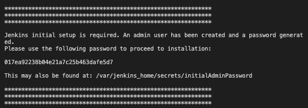
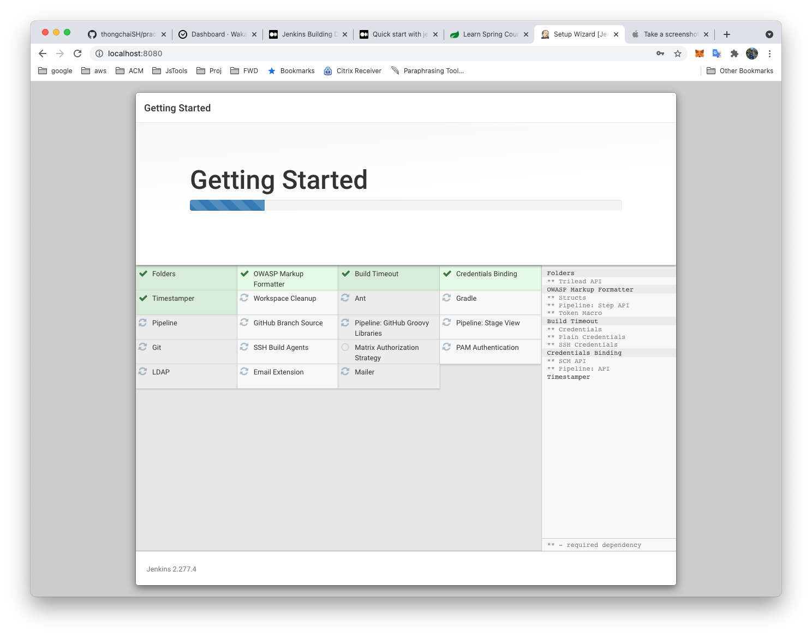
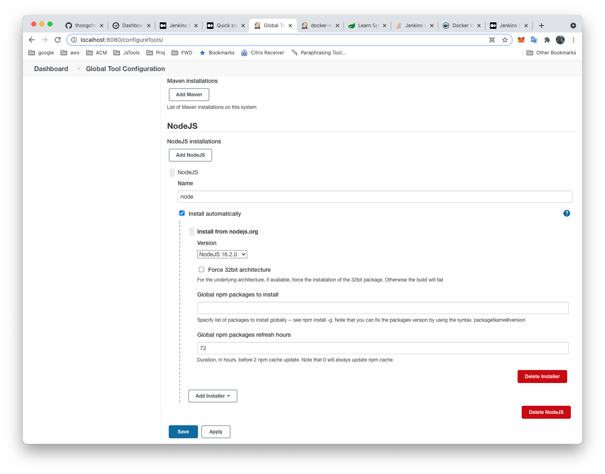
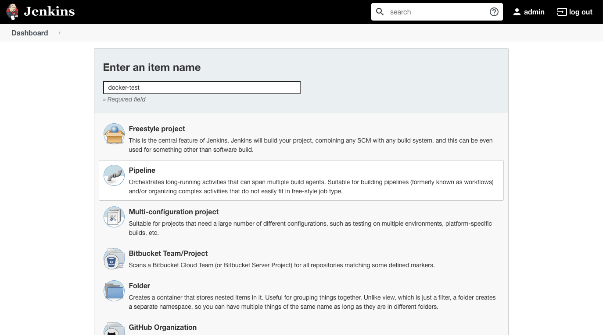
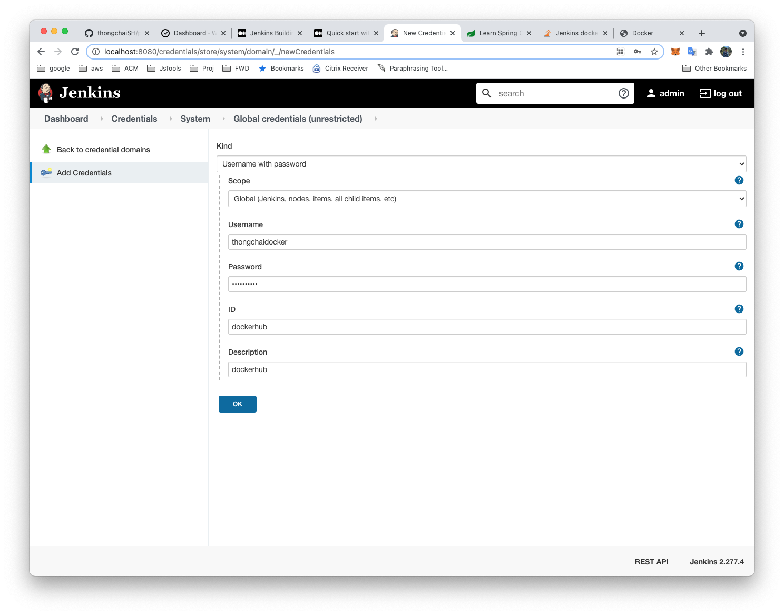
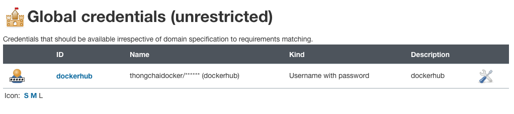
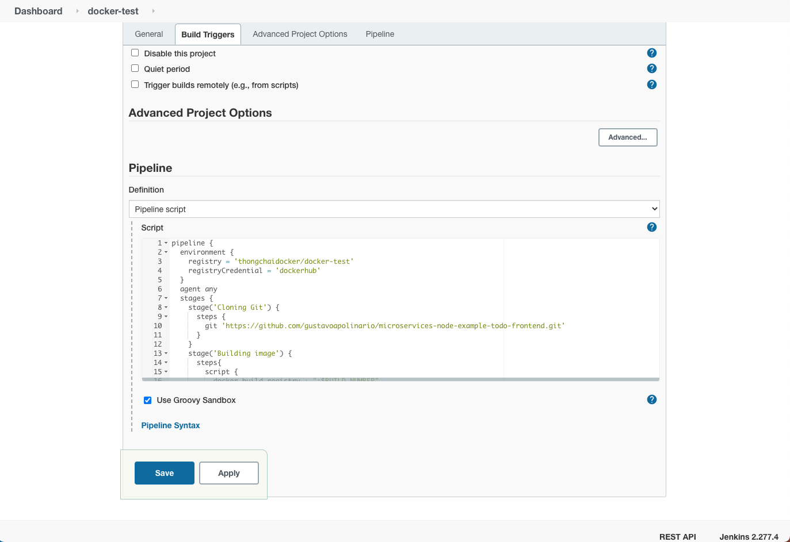

# Jenkins Building Docker Image and Sending to Registry

## Jenkins with docker installed
```
docker build -t  jenkins-docker .
```
### Run jenkins with docker from host
```
docker run --name jenkins-docker -p 8080:8080 -v /var/run/docker.sock:/var/run/docker.sock jenkins-docker
```
### Set share docker
```
docker exec -u root -it jenkins-docker bash
usermod -G sudo jenkins
chmod 777 -R /var/run/docker.sock
```


### Open jenkins via browser
[jenkins](localhost:8080)
```
developer/developer
admin/admin
```

## Setup jenkins
### Enter key


### Install default plugin


### Install plugin
- locale
- blueocean
- Docker Pipeline
- NodeJS

### Config NodeJs ,JDK
- http://localhost:8080/configureTools/
#### Node JS

```
pipeline {
  agent any
 
  tools {nodejs "node"}
 
  stages {
    stage('Example') {
      steps {
        sh 'npm config ls'
      }
    }
  }
}
```

## Setup
## Create job



## Credential
- http://localhost:8080/credentials/
- http://localhost:8080/credentials/store/system/domain/_/newCredentials

Global credentials


## Pipeline script


**Example clone and build**
```groovy
pipeline {
  environment {
    registry = 'thongchaidocker/docker-test'
    registryCredential = 'dockerhub'
  }
  agent any
  stages {
    stage('Cloning Git') {
      steps {
        git 'https://github.com/gustavoapolinario/microservices-node-example-todo-frontend.git'
      }
    }
    stage('Building image') {
      steps{
        script {
          docker.build registry + ":$BUILD_NUMBER"
        }
      }
    }
  }
}

```

## Deploying the docker image to dockerhub
### First, create an environment 
```
dockerImage = ''
```
### set build version to variable dockerImage
```
dockerImage = docker.build registry + ":$BUILD_NUMBER"
```
### Ceate a new stage to push the docker image builded to dockerhub.
```groovy
stage('Deploy Image') {
  steps{
    script {
      docker.withRegistry( '', registryCredential ) {
        dockerImage.push()
      }
    }
  }
}
```
### After build and deploy, delete the image to cleanup your server space.
```groovy
stage('Remove Unused docker image') {
  steps{
    sh "docker rmi $registry:$BUILD_NUMBER"
  }
}
```